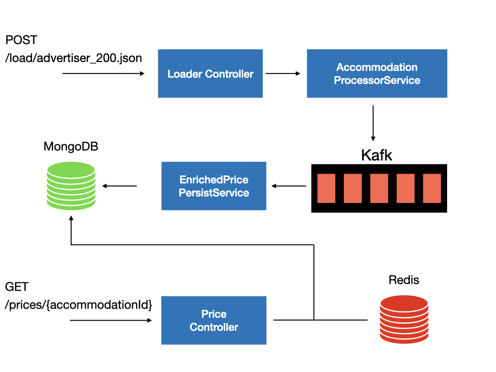

# Template Case Study

Here is a brief description of the project architecture:
The input data is loaded through various DataLoaders(inside `services/dataloader`) and enriched to become `EnrichedPrice`
and then streamed into Kafka. A consumer reads enriched prices and persist them into MongoDB as our database. Whenever a
request is made to `/prices` endpoint: if the result is not already cached in Redis, a query is made to MongoDB. Otherwise,
the cached result is returned.



## Setup Instructions

1. Run `docker compose up -d` in the project folder to spin up mongoDB, Kafka, and Redis instances.
2. Run `mvn clean install` to build the project.
4. Run `mvn spring-boot:run` to start the application.

## Usage Instructions

1. Send a POST request to `/load` endpoint to process input data:
```
curl -X POST http://localhost:8080/load/ \
     -H "Content-Type: text/plain" \
     -d "/prices/advertiser_100.yaml"
```
2. Send a GET request to fetch the price info:
``` 
curl -X GET http://localhost:8080/prices/0 \
     -H "Accept: application/json"
```

## Questions

### How could a partner with a potentially slow REST interface be integrated?

In order to integrate a REST endpoint as a data provider to our application, `DataLoader` interface can be extended to 
load data from a REST URL. It is worth mentioning that our endpoint performance is not affected by the slowness of the
third-party API. Because the request will be handled asynchronously and the data will be streamed into Kafka, and then
consumed and persisted to our database. But we need to make sure upon receiving new data our cache is accordingly evicted
to be filled with fresh data later.

### How could your solution scale for multiple thousand requests per second?

To ensure the scalability of the service, certain design decisions has been made:
1. Data providers share a unified API to load data from various sources, and stream their data into Kafka. Thus, our 
response time is not affected by their speed or complexity of operation.
2. Price data is consumed from Kafka and is persisted in MongoDB which can simply scale and hold huge amount of data.
3. There is also a caching mechanism based on Redis in `PriceService`, to reduce number of requests made to the DB.
4. This architecture enables us to horizontally scale the number of pods and distribute the incoming traffic through a
load-balancing mechanism.
